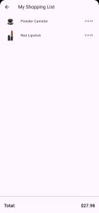
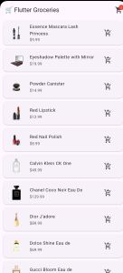

# Flutter Shopping List App 🛒
A simple and elegant shopping list application built with Flutter. This app allows users to browse a list of products fetched from a remote API, add items to their personal shopping list, and view the total cost. It serves as a great example for practicing basic data handling, state management, and API integration in Flutter.
## Screenshot
     

## ✨ Features 📷

  * Browse Products: Fetches and displays a list of products from the DummyJSON API.

 * Add to Cart: Users can add any product to their shopping list with a single tap.

  * Shopping List View: A separate screen to view all selected items.

  * Dynamic Item Count: The cart icon on the app bar shows a real-time count of items in the list.

  * Total Cost Calculation: Automatically calculates and displays the total price of all items in the shopping list.

  * Asynchronous Data Fetching: Utilises FutureBuilder for a smooth user experience while loading data.

## 🛠️ Tech Stack & Dependencies

  - Framework: [Flutter](https://flutter.dev/)

  - Language: [Dart](https://dart.dev/)

  - API: [DummyJSON](https://dummyjson.com/) for product data.

  - Packages:

    - `http`: For making network requests to the API.

## 🚀 Getting Started

Follow these instructions to get a copy of the project up and running on your local machine for development and testing purposes.

Prerequisites
  - Flutter SDK installed (version 3.x.x or higher)

  - An IDE like Android Studio or VS Code with Flutter plugins.
  
  - A device or emulator to run the app.

Installation

  1. Clone the repository:
      ```
      git clone https://github.com/sachinksamad1/shopping_list_app.git
      cd flutter-shopping-list-app
      ```

  2. Install dependencies:
     Run the following command in your terminal to fetch all the necessary packages.
      ```
       flutter pub get
      ```
  3. Run the application:
     Connect your device or start an emulator, then run the app.
      ```
      flutter run
      ```

## 📂 Project Structure
The project is structured to separate concerns, making it easy to understand and maintain.
```
lib/
├── services/api_service.dart      # Handles all API network requests.
├── models/product_model.dart    # Data model for a single product.
├── screens/
|       └── product_list_screen.dart # UI for displaying the list of all products.
|        └──cart_screen.dart      # UI for the shopping cart/list page.
└── main.dart             # The main entry point of the application.
```

## 🤝 Contributing
Contributions are what make the open-source community such an amazing place to learn, inspire, and create. Any contributions you make are greatly appreciated.

If you have a suggestion that would make this better, please fork the repo and create a pull request. You can also simply open an issue with the tag "enhancement".

  - Fork the Project

  - Create your Feature Branch (git checkout -b feature/AmazingFeature)

  - Commit your Changes (git commit -m 'Add some AmazingFeature')

  - Push to the Branch (git push origin feature/AmazingFeature)

  - Open a Pull Request

## 📄 License
This project is licensed under the MIT License - see the [LICENSE](LICENSE) file for details.

Made with ❤️ by SACHIN K SAMAD
